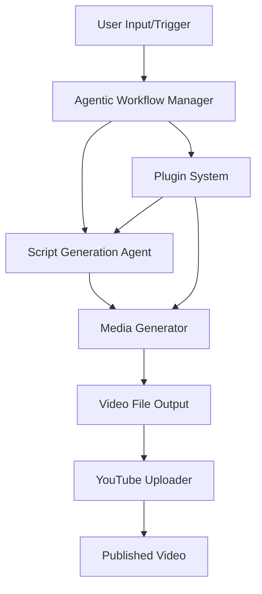

# Agentic-Youtuber

## Introduction

Agentic-Youtuber is an open-source project designed to automate content creation and management for YouTube channels using agent-based AI workflows. This repository leverages modern AI models and scripting to streamline tasks like video generation, content planning, and publishing. It empowers creators and developers to enhance their YouTube presence with intelligent automation.

## Features

- Automated video scripting and generation using AI agents
- Content planning and scheduling for consistent uploads
- Integration with YouTube Data API for uploading and managing videos
- Flexible plugin system for custom workflows and content pipelines
- Configurable prompts and agent behaviors for tailored content
- Support for multiple AI models and external APIs
- Modular architecture for easy extension

## Requirements

To use Agentic-Youtuber, ensure your system meets the following requirements:

- Python 3.8 or higher
- pip package manager
- YouTube Data API access (API key required)
- OpenAI API key (or compatible LLM provider)
- FFmpeg (for media processing)
- Required Python packages as listed in `requirements.txt`:
  - openai
  - google-api-python-client
  - pyyaml
  - requests
  - (other dependencies as specified)

## Usage

Follow these steps to get started with Agentic-Youtuber:

1. **Clone the repository**
   ```bash
   git clone https://github.com/sannjaay/Agentic-Youtuber.git
   cd Agentic-Youtuber
   ```

2. **Install dependencies**
   ```bash
   pip install -r requirements.txt
   ```

3. **Configure API keys**
   - Set your OpenAI (or compatible LLM provider) API key.
   - Set your YouTube Data API key in the configuration file or as environment variables.

4. **Run the main script**
   ```bash
   python main.py
   ```

5. **Interact with the agent**
   - Use the command-line interface to initiate content workflows.
   - Follow prompts to select content topics, schedule uploads, and review generated scripts.

6. **Upload videos**
   - The agent will automatically upload videos using your configured YouTube channel credentials.

## Configuration

Agentic-Youtuber uses a YAML or JSON configuration file to manage settings:

- **API Keys**: Store your OpenAI and YouTube Data API keys securely.
- **Content Options**: Set preferred video length, topics, and upload schedule.
- **Agent Settings**: Customize prompt templates, agent roles, and response behaviors.
- **Output Directory**: Choose where generated scripts and video files are saved.
- **Plugin Paths**: Add directories for custom plugins and extensions.

Example configuration snippet:

```yaml
api_keys:
  openai: "your-openai-api-key"
  youtube: "your-youtube-api-key"

content:
  topics: ["AI news", "Tutorials", "Reviews"]
  video_length: 10  # in minutes
  schedule: "weekly"

agent:
  prompt_template: "Write a YouTube video script about {topic}."
  creativity: 0.8

output:
  directory: "./output"
```

Adjust these values as needed for your workflow. For more advanced configuration, refer to the documentation within each module or script.

---

## Architecture Overview

The following flowchart illustrates the core workflow of Agentic-Youtuber:



---

## Support and Contribution

- Open issues for questions or bug reports.
- Submit pull requests for improvements or new features.
- See `CONTRIBUTING.md` for detailed contribution guidelines.

---

## License

This project is licensed under the MIT License. See `LICENSE` for details.